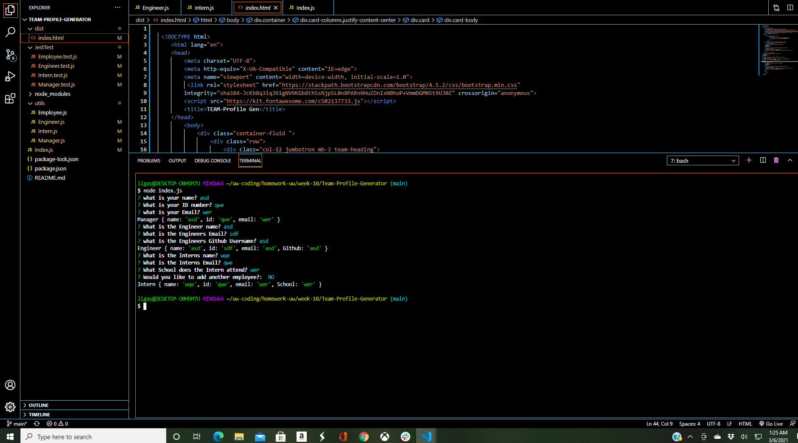

# Team-Profile-Generator

# Description
This website is built to help managers take different employee profiles, which includes the role, email, name and Id number of various Employees. After answering a series of questions/prompts, a HTML webpage will be generated with simple layout of different Employees information. 
# Table of Contents

# How to install
<ul>
<li> Clone Repo</li>
<li> NPM Intall into command line </li>
<li> Answer the questions/prompts </li>
<li> HTML rendered </li>
</ul>

# ScreenShot

# Walkthrough
<iframe src="https://drive.google.com/file/d/1yUEnuL_AlQc_d8qhdSUaMJgOV5Xxa9V3/preview" width="640" height="480"></iframe>
